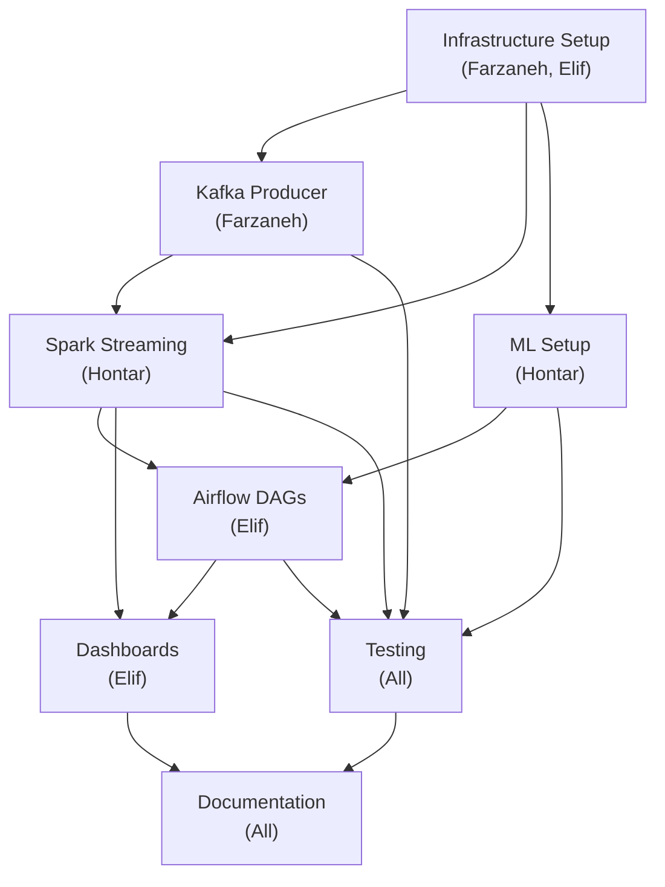

# Team Task Breakdown - Fraud Detection System
## 4-Person Team Project Allocation

**Project**: Real-Time Financial Fraud Detection System  
**Duration**: 6 weeks  
**Team Size**: 4 members  
**Repository**: [GitHub - Create your repo and reference here]

---

## 📋 Team Structure

| Name | Role | Responsibility | Ownership Areas |
|------|------|-----------------|-----------------|
| **Khurshid Normurodov** |Data Architect | Overall design |
| **Farzaneh Barzegar** | Project Lead /  Data Ingestion Engineer | Kafka cluster setup, raw event pipeline | Kafka, Producer, Data Generation |
| **Hontar Daniil** | Data Processing & ML Engineer | Spark Streaming, feature engineering, XGBoost fraud scorer, MLflow | Spark Jobs, Silver/Gold Layers, ML Training, Feature Engineering |
| **Elif Sila Okutucu** | Analytics & DevOps Engineer | Airflow DAGs, Delta Lake layers, Grafana dashboards, Docker | Docker, Airflow, PostgreSQL, Grafana, Monitoring |

---

## 🎯 Phase 1: Infrastructure & Setup (Week 1)

### Task Group 1.1 - GitHub Repository Setup (Khurshid)

**Deliverables:**
- [ ] Create GitHub repository with proper naming convention
- [ ] Set up branch protection rules (main, develop, feature branches)
- [ ] Create `.gitignore` (Python, Docker, ML artifacts)
- [ ] Add CODE_OF_CONDUCT.md
- [ ] Add CONTRIBUTING.md with development guidelines
- [ ] Set up GitHub Projects board (Kanban)
- [ ] Add team members as collaborators with appropriate permissions
- [ ] Create pull request template
- [ ] Set up GitHub Issues templates (feature, bug, documentation)
- [ ] Document commit message conventions (conventional commits)

**Acceptance Criteria:**
- All team members can clone and contribute
- Branch protection on main requires 1 approval + CI passing
- GitHub Projects board linked to issues

**Dependencies:** None

---

### Task Group 1.3 - PostgreSQL Initialization (Elif)

**Deliverables:**
- [ ] Create `scripts/init_postgres.sql` with:
  - Create 3 databases: `airflow`, `mlflow`, `fraud`
  - Create `fraud_metrics` table:
    ```sql
    fraud_metrics (
      timestamp, transaction_id, user_id, amount, 
      is_flagged, fraud_score, rule_score, ml_score, reason
    )
    ```
  - Create `dq_checks` table:
    ```sql
    dq_checks (
      check_timestamp, check_name, status, record_count, 
      null_rate, pass_rate, details
    )
    ```
  - Create `model_registry` table:
    ```sql
    model_registry (
      model_id, model_name, version, created_at, 
      roc_auc, pr_auc, precision, recall, status
    )
    ```
- [ ] Document table schemas
- [ ] Create sample queries for common analytics
- [ ] Test connections and permissions

**Acceptance Criteria:**
- All tables created with correct schemas
- Spark and Airflow can connect and write data
- Grafana can query tables

**Dependencies:** Docker setup complete

---

### Task Group 1.4 - Synthetic Dataset Preparation (Farzaneh)

**Khurshid's Tasks:**
- [ ] Acquire or generate synthetic fraud dataset (21 features, 100K+ records)
- [ ] Perform exploratory data analysis (EDA):
  - Data distribution analysis
  - Class balance analysis (fraud rate)
  - Feature correlations
  - Missing values analysis
- [ ] Create `data/synthetic_fraud_dataset.csv`
- [ ] Document dataset in `documentation/05_datasets.md`:
  - Feature descriptions
  - Data statistics
  - Fraud patterns present
  - Data quality issues

**Farzaneh's Tasks:**
- [ ] Validate data quality
- [ ] Document any data preprocessing needed
- [ ] Test data loading in producer

**Deliverables:**
- `data/synthetic_fraud_dataset.csv` (100K+ rows)
- `documentation/05_datasets.md` (comprehensive)
- EDA notebook (optional, educational)

**Acceptance Criteria:**
- Dataset has 100K+ records
- ~1-5% fraud rate
- 21 features with proper types
- No corrupted records

**Dependencies:** None (can work in parallel)

---

## 🚀 Phase 2: Streaming Pipeline (Week 2-3)

### Task Group 2.1 - Kafka Producer (Farzaneh)

**Deliverables:**
- [ ] Create `producer/transaction_generator.py`:
  - Load synthetic_fraud_dataset.csv
  - Configure transaction rate (TPS)
  - Replay records to Kafka topic `raw-transactions`
  - Serialize to JSON schema
- [ ] Create `producer/Dockerfile`
- [ ] Create `producer/requirements.txt`:
  - kafka-python
  - pandas
  - numpy
- [ ] Add fraud injection logic (optional enhancement):
  - Inject synthetic fraud patterns (5 types)
  - Control fraud rate via environment variable
- [ ] Document producer configuration
- [ ] Add logging and error handling
- [ ] Add health check endpoint (if applicable)
- [ ] Create unit tests for data validation

**Acceptance Criteria:**
- Producer sends 10-100 TPS to Kafka
- Messages valid JSON with correct schema
- Handles connection errors gracefully
- Logs transaction counts every minute

**Test Script:**
```bash
# Terminal 1: Run producer
python producer/transaction_generator.py

# Terminal 2: Consume and verify
make kafka-consume
```

**Dependencies:** Docker setup, PostgreSQL initialization

---

### Task Group 2.2 - Bronze Layer (Hontar)

**Deliverables:**
- [ ] Create Bronze layer in `spark_jobs/fraud_streaming_job.py`:
  - Read from Kafka topic `raw-transactions`
  - Schema enforcement (enforce correct column types)
  - Append-only write to Delta Lake `/data/delta/bronze`
  - Add `_ingested_at` timestamp
  - Add `_record_id` (unique per record)
- [ ] Create Delta table configuration
- [ ] Add schema validation
- [ ] Add error handling and dead-letter queue
- [ ] Add checkpointing
- [ ] Document Bronze layer design

**Acceptance Criteria:**
- All Kafka records successfully written to Bronze
- No data loss or duplicates
- Checkpoint recovery works
- Bronze table readable by Spark SQL

**Test Query:**
```sql
SELECT COUNT(*), AVG(Transaction_Amount) FROM bronze_transactions
```

**Dependencies:** Kafka Producer running

---

### Task Group 2.3 - Silver Layer (Hontar)

**Deliverables:**
- [ ] Create Silver layer in `spark_jobs/fraud_streaming_job.py`:
  - **Feature Engineering** - Compute 10 derived features:
    ```
    log_amount: log(1 + Transaction_Amount)
    event_hour: hour of day (0-23)
    amount_bucket: categorical [low, medium, high, very_high]
    merchant_risk_score: lookup from risky merchants
    day_of_week: day (0-6)
    is_weekend: binary
    transaction_count_today: daily count per user
    ```
  - **Fraud Signals** - Compute 5 flags:
    ```
    flag_high_amount: amount > $3,000
    flag_velocity: daily_count ≥ 6 OR failed_txns ≥ 3
    flag_off_hours: hour in [2, 3, 4]
    flag_risky_merchant: merchant category risky
    flag_geo_anomaly: distance > 75km from usual location
    ```
  - **Rule Score** - Weighted sum:
    ```
    rule_score = (
      0.25 * flag_high_amount +
      0.25 * flag_velocity +
      0.15 * flag_off_hours +
      0.20 * flag_risky_merchant +
      0.15 * flag_geo_anomaly
    )
    ```
  - Write to Delta Lake `/data/delta/silver`
  - Add feature metadata (importance, description)

**Acceptance Criteria:**
- All 10 features computed correctly
- All 5 flags computed correctly
- rule_score between 0-1
- No null values in computed features
- Stateful aggregations maintain state across batches

**Test:**
```sql
SELECT * FROM silver_features WHERE rule_score > 0.5 LIMIT 10
```

**Dependencies:** Bronze layer working

---

### Task Group 2.4 - ML Score Integration (Hontar)

**Deliverables:**
- [ ] In Silver layer, add ML scoring:
  - Load `fraud_model.pkl` from shared volume (if exists)
  - If model loaded: compute ML score using XGBoost predict
  - If model NOT loaded: return 0.0 placeholder
  - Add logging: "Model loaded successfully" or "Model not found, using rule_score only"
- [ ] Handle model version mismatches
- [ ] Add inference latency monitoring
- [ ] Document ML score integration

**Acceptance Criteria:**
- ML scoring works when model exists
- Graceful fallback when model missing
- Latency < 100ms per batch
- Scores between 0-1

**Dependencies:** ML training pipeline created

---

### Task Group 2.5 - Gold Layer & Flagging (Hontar)

**Deliverables:**
- [ ] Create Gold layer in `spark_jobs/fraud_streaming_job.py`:
  - **Compute final fraud_score**: `max(rule_score, ml_score)`
  - **Flag decision**: `is_flagged = (fraud_score ≥ 0.35)`
  - Filter to only flagged transactions
  - Write to Delta Lake `/data/delta/gold`
  - **Output 1 - Kafka**: Publish to `flagged-transactions` topic:
    ```json
    {
      "transaction_id", "user_id", "amount", "fraud_score",
      "reason": [list of fired flags], "timestamp"
    }
    ```
  - **Output 2 - PostgreSQL**: Write to `fraud_metrics` table
  - **Output 3 - Metrics**: Aggregate counts by hour, write to PostgreSQL
- [ ] Add alert thresholds
- [ ] Document flagging logic

**Acceptance Criteria:**
- Flagged transactions reach all 3 outputs
- fraud_score_threshold configurable
- Kafka topic has correct schema
- PostgreSQL receives hourly aggregates

**Deliverables:**
- `spark_jobs/fraud_streaming_job.py` (complete)
- `spark_jobs/requirements.txt`
- `data/delta/bronze`, `silver`, `gold` (properly structured)

**Test:**
```bash
# Terminal 1
make kafka-consume-fraud  # See flagged transactions

# Terminal 2
psql -h localhost -U postgres -d fraud -c "SELECT COUNT(*) FROM fraud_metrics"
```

**Dependencies:** Silver layer working

---

## 🤖 Phase 3: ML Training & Tracking (Week 3)

### Task Group 3.1 - ML Training Pipeline (Hontar)

**Deliverables:**
- [ ] Create `ml/train_model.py`:
  - Load Silver data (or CSV for initial training)
  - Feature selection (10 most important features)
  - Handle class imbalance:
    - Use stratified train/test split (80/20)
    - Set `scale_pos_weight = num_neg / num_pos`
  - Train XGBoost classifier:
    ```python
    XGBClassifier(
      n_estimators=300,
      max_depth=6,
      learning_rate=0.05,
      scale_pos_weight=99,  # Adjust based on data
      random_state=42
    )
    ```
  - Compute metrics:
    - ROC-AUC, PR-AUC
    - Precision, Recall, F1
    - Feature importances
  - Save model to `models/fraud_model.pkl`
- [ ] Create `ml/requirements.txt`:
  - xgboost
  - scikit-learn
  - mlflow
  - pandas
  - numpy
- [ ] Add data validation
- [ ] Add logging

**Acceptance Criteria:**
- Model trains successfully
- ROC-AUC ≥ 0.85
- PR-AUC ≥ 0.70
- Model serializes to pickle
- Inference time < 100ms per batch

**Run:**
```bash
make train
```

**Dependencies:** Silver layer data available

---

### Task Group 3.2 - MLflow Tracking & Registry (Hontar)

**Deliverables:**
- [ ] In `ml/train_model.py`, add MLflow tracking:
  - Log metrics: ROC-AUC, PR-AUC, Precision, Recall, F1
  - Log parameters: n_estimators, max_depth, learning_rate, etc.
  - Log feature importances as artifact (JSON)
  - Log model artifact: `fraud_model.pkl`
  - Create experiment: "fraud-detection"
  - Create run: one per training
- [ ] Set up MLflow server connection:
  - `MLFLOW_TRACKING_URI=http://mlflow:5001`
  - `MLFLOW_REGISTRY_URI=postgresql://...`
- [ ] Create model versioning workflow:
  - New trained models → stage "Staging"
  - After evaluation → promote to "Production"
  - Keep previous version as "Archived"
- [ ] Document model registry schema
- [ ] Add comparison between runs

**Acceptance Criteria:**
- MLflow UI shows experiments & runs
- Model artifacts stored correctly
- Can load models from registry

**Check MLflow:**
```
http://localhost:5001  # View experiments
```

**Dependencies:** ML training complete

---

### Task Group 3.3 - Model Evaluation & Promotion (Hontar)

**Deliverables:**
- [ ] Create `ml/evaluate_model.py`:
  - Load trained model
  - Evaluate on test set
  - Compare metrics to production model
  - Decision logic:
    - If PR-AUC improvement ≥ 2% → promote to Production
    - Else → keep in Staging
  - Log decision with reasoning
  - Update `model_registry` PostgreSQL table
- [ ] Add performance threshold checks
- [ ] Create evaluation report (JSON/CSV)

**Acceptance Criteria:**
- Evaluation runs automatically
- Promotion logic documented
- Decision traceable in MLflow

**Dependencies:** MLflow tracking working

---

## 📊 Phase 4: Orchestration & Monitoring (Week 4)

### Task Group 4.1 - Airflow Setup (Elif)

**Deliverables:**
- [ ] Create Airflow home directory structure:
  - `dags/` - DAG definitions
  - `logs/` - DAG logs
  - `plugins/` - Custom operators/sensors (if needed)
- [ ] Create `dags/requirements.txt`:
  - apache-airflow
  - apache-airflow-providers-postgres
  - apache-airflow-providers-apache-spark
  - psycopg2-binary
  - delta-spark (if using Delta Lake)
- [ ] Create Airflow connections in `dags/init_airflow.py`:
  - PostgreSQL connection
  - Spark connection
  - MLflow connection
- [ ] Create `dags/config.yaml` with DAG parameters:
  - Schedule intervals
  - Retries
  - Timeouts
  - Alert emails
- [ ] Document Airflow setup and access

**Acceptance Criteria:**
- Airflow UI accessible at http://localhost:8082
- All connections configured
- DAGs discoverable and runnable

**Access Airflow:**
```
http://localhost:8082
Username: admin
Password: (from .env AIRFLOW_ADMIN_PASSWORD)
```

**Dependencies:** Docker setup complete

---

### Task Group 4.2 - Daily Model Retraining DAG (Elif + Hontar)

**Deliverables:**
- [ ] Create `dags/fraud_detection_daily_dag.py`:
  - **DAG Name**: `fraud_detection_daily`
  - **Schedule**: Daily at 00:00 UTC
  - **Timeout**: 2 hours
  
  **Tasks:**
  ```
  start
    ├─► validate_silver_data
    │     └─ Check row count ≥ yesterday's count
    │     └ Check schema matches
    │
    ├─► decide_retrain
    │     └─ Branch decision: retrain_needed?
    │       ├─ YES → retrain_model
    │       └─ NO  → skip_retrain
    │
    ├─► retrain_model (SparkSubmitOperator)
    │     └─ Run ml/train_model.py on Spark
    │     └─ Output: fraud_model.pkl
    │
    ├─► evaluate_model
    │     └─ Run ml/evaluate_model.py
    │     └─ Compare to production model
    │
    ├─► promote_to_gold (BranchPythonOperator)
    │     └─ If metrics improved → promote
    │     └─ Else → keep staging
    │
    └─► send_notification
          └─ Slack/Email with metrics summary
  ```

- [ ] Add SLAs: 30 min per task
- [ ] Add retry logic: 2 retries on failure
- [ ] Add monitoring: task duration, success/failure logging
- [ ] Add data quality checks before retraining

**Acceptance Criteria:**
- DAG runs successfully daily
- All tasks complete within SLA
- Model pickle updated in shared volume
- Notifications sent on success/failure
- Can view full task history in Airflow UI

**Dependencies:** ML training pipeline complete

---

### Task Group 4.3 - Hourly Data Quality Monitoring DAG (Elif)

**Deliverables:**
- [ ] Create `dags/data_quality_monitoring_dag.py`:
  - **DAG Name**: `data_quality_monitoring`
  - **Schedule**: Hourly at :00
  - **Timeout**: 10 minutes
  
  **Tasks:**
  ```
  start
    ├─► bronze_row_count_check
    │     └─ Assert count > 0
    │     └─ Store result in PostgreSQL
    │
    ├─► bronze_schema_check
    │     └─ Validate column names and types
    │     └─ Store result in PostgreSQL
    │
    ├─► silver_null_rate_check
    │     └─ Check nulls < 2%
    │     └─ Store per-column nulls
    │     └─ Alert if > threshold
    │
    ├─► fraud_rate_check
    │     └─ Calculate hourly fraud rate
    │     └─ Check for anomalies
    │     └─ Alert if > 10% or < 0.1%
    │
    ├─► gold_consistency_check
    │     └─ Verify fraud_score distribution
    │     └─ Check for missing features
    │
    └─► consolidate_dq_report
          └─ Write summary to PostgreSQL dq_checks table
          └─ Create daily report
  ```

- [ ] Add alerting thresholds (configurable)
- [ ] Create `scripts/dq_checks.sql` with check queries
- [ ] Add data quality metrics to PostgreSQL `dq_checks` table
- [ ] Document DQ thresholds and actions

**Acceptance Criteria:**
- DQ DAG runs hourly without failure
- All checks complete in < 10 minutes
- Results stored in PostgreSQL
- Alerts trigger on threshold breach
- Grafana can visualize DQ status

**Dependencies:** Airflow setup, Data in Bronze/Silver/Gold

---

### Task Group 4.4 - PostgreSQL Integration (Elif)

**Deliverables:**
- [ ] Create custom Airflow operators/sensors for PostgreSQL:
  - PostgreSQL write operator (batch insert metrics)
  - PostgreSQL read sensor (wait for data)
- [ ] Create `scripts/postgres_queries.sql`:
  - Sample queries for fraud metrics
  - DQ summary queries
  - Model performance queries
- [ ] Set up connection pooling if needed
- [ ] Add logging for all writes
- [ ] Document table write schemas

**Acceptance Criteria:**
- All DAG tasks can write to PostgreSQL
- Connections pool correctly
- Data accessible via psql and Grafana

**Test Connection:**
```bash
psql -h localhost -U postgres -d fraud \
  -c "SELECT COUNT(*) FROM fraud_metrics"
```

**Dependencies:** PostgreSQL initialization complete

---

## 📈 Phase 5: Analytics & Dashboards (Week 5)

### Task Group 5.1 - Grafana Setup (Elif)

**Deliverables:**
- [ ] Create `grafana/provisioning/datasources/datasource.yaml`:
  - PostgreSQL data source configuration
  - Connection settings
  - Test connection works
- [ ] Create `grafana/provisioning/dashboards/dashboard.yaml`:
  - Dashboard provisioning configuration
- [ ] Create `grafana/dashboards/fraud_overview.json`:
  - **Dashboard Panels**:
    1. **KPI Cards**:
       - Total transactions (24h)
       - Flagged transactions (24h)
       - Fraud rate (%)
       - Model accuracy (PR-AUC)
    
    2. **Time Series**:
       - Flagged transactions per hour
       - Fraud rate trend (7-day)
       - Model performance trend
       - Rule score vs ML score comparison
    
    3. **Heatmaps**:
       - Fraud flags heatmap (by hour of day)
       - Fraud by merchant category
    
    4. **Data Quality**:
       - DQ check pass rate (hourly)
       - Null rate by column
       - Record count trend
    
    5. **Model**:
       - Feature importance bar chart
       - ROC-AUC history
       - PR-AUC history
       - Confusion matrix

- [ ] Add alerting rules:
  - Fraud rate spike alert (> 5%)
  - Pipeline latency alert (> 30s)
  - DQ check failure alert
- [ ] Test all panels with sample data

**Acceptance Criteria:**
- Dashboard accessible at http://localhost:3000
- All panels show correct data
- Alerts trigger correctly
- Auto-refresh every 30 seconds
- Can drill down to details

**Access Grafana:**
```
http://localhost:3000
Username: admin
Password: (from .env GRAFANA_PASSWORD)
```

**Dependencies:** PostgreSQL has data, Airflow DAGs running

---

### Task Group 5.2 - Advanced Dashboards (Elif - Optional Enhancement)

**Deliverables:**
- [ ] Create `grafana/dashboards/fraud_details.json`:
  - Detailed transaction explorer
  - Filter by: date, amount, merchant, user
  - Show fraud reasons (which flags triggered)
  
- [ ] Create `grafana/dashboards/model_performance.json`:
  - Model experiment comparison
  - Feature importance drill-down
  - Cross-validation metrics
  
- [ ] Create `grafana/dashboards/dq_monitoring.json`:
  - Data quality scorecards
  - Pipeline health status
  - SLA tracking

**Acceptance Criteria:**
- All dashboards provisioned automatically
- Can switch between dashboards easily
- All queries optimized

**Dependencies:** Advanced analytics requirements

---

## 🧪 Phase 6: Testing & Documentation (Week 5-6)

### Task Group 6.1 - Unit Tests (Hontar + Farzaneh)

**Farzaneh - Producer Tests:**
- [ ] Create `tests/test_producer.py`:
  - Test data loading from CSV
  - Test JSON serialization
  - Test Kafka connection
  - Test fraud injection logic
  - Test error handling

**Hontar - Spark Job Tests:**
- [ ] Create `tests/test_spark_job.py`:
  - Test schema validation
  - Test feature engineering logic
  - Test fraud scoring
  - Test Delta writes
  - Test checkpoint recovery

**Test Framework**: pytest

**Acceptance Criteria:**
- All tests pass
- Code coverage ≥ 80%
- Run: `make test`

**Dependencies:** All components complete

---

### Task Group 6.2 - Integration Tests (Hontar + Elif)

**Deliverables:**
- [ ] Create `tests/test_integration.py`:
  - End-to-end pipeline test
  - Send test transaction → verify in fraud_metrics table
  - Verify all three outputs (Delta, Kafka, PostgreSQL)
  - Verify Airflow DAG execution
  - Verify Grafana data sync
- [ ] Create `tests/conftest.py`:
  - Docker Compose test fixtures
  - Database cleanup
  - Kafka topic management

**Acceptance Criteria:**
- Full pipeline works end-to-end
- Can start clean and ingest 100 transactions
- All outputs have matching data

**Run:**
```bash
make test-integration
```

**Dependencies:** All components complete

---

### Task Group 6.3 - Documentation (All)

**Farzaneh - Coordination:**
- [ ] Create TEAM_ROLES.md (what each person owns)
- [ ] Create DEVELOPMENT_WORKFLOW.md:
  - Git workflow (feature branches, PRs)
  - Commit message conventions
  - Code review checklist
  - Deployment process

**All Team Members - Component Docs:**
- [ ] Update each component's README:
  - `producer/README.md`
  - `spark_jobs/README.md`
  - `ml/README.md`
  - `dags/README.md`
  - `grafana/README.md`

**Documentation Requirements per Component:**
```markdown
# Component Name

## Overview
[What it does, why it matters]

## Architecture
[Diagram if applicable]

## Configuration
[Environment variables, parameters]

## How to Run
[Step-by-step]

## Troubleshooting
[Common issues & solutions]

## Code Structure
[File organization]

## Testing
[How to test locally]

## Deployment
[How to deploy]

## Future Improvements
[Known limitations, TODOs]
```

**Farzaneh - Main Documentation:**
- [ ] Update main `README.md`:
  - Quick start (5 min)
  - Architecture overview
  - Technology stack
  - Team roles
  - Contributing guidelines
  - Troubleshooting section

- [ ] Create `CONTRIBUTING.md`:
  - Branch naming: `feature/`, `fix/`, `docs/`
  - Commit message format
  - PR process
  - Code review guidelines
  - Release process

- [ ] Create `ARCHITECTURE.md`:
  - System design diagram
  - Data flow diagrams
  - Component interactions
  - Deployment topology

**Acceptance Criteria:**
- All components documented
- README complete and accurate
- New contributor can set up in < 20 minutes
- All code has docstrings

**Dependencies:** All components complete

---

### Task Group 6.4 - Performance & Load Testing (Hontar)

**Deliverables:**
- [ ] Create `tests/test_performance.py`:
  - Streaming throughput: measure TPS
  - Feature engineering latency per transaction
  - ML scoring latency
  - Kafka consumer lag
  - Database write performance
  
- [ ] Create `tests/test_load.py`:
  - Test at 100 TPS (normal load)
  - Test at 500 TPS (peak load)
  - Test at 1000 TPS (stress test)
  - Measure CPU, memory, latency
  
- [ ] Document performance baselines:
  - Normal TPS
  - Max TPS before degradation
  - Latency thresholds

**Acceptance Criteria:**
- System handles 100 TPS without issues
- Degradation < 10% at 500 TPS
- Can identify bottlenecks

**Dependencies:** Full system working

---

## 📅 Detailed Timeline

### Week 1 - Infrastructure
- **Team**: Khurshid , Elif (Docker), Farzaneh (data)
- **Tasks**: 1.1, 1.2, 1.3, 1.4
- **Deliverable**: Working Docker environment + dataset

### Week 2 - Streaming Pipeline (Part 1)
- **Team**: Farzaneh (producer), Hontar (streaming)
- **Tasks**: 2.1, 2.2, 2.3, 2.4
- **Deliverable**: Data flowing through Bronze → Silver → Gold layers

### Week 3 - ML & Streaming Complete
- **Team**: Hontar (ML + streaming), Farzaneh (producer support)
- **Tasks**: 2.5, 3.1, 3.2, 3.3
- **Deliverable**: Trained model + integrated ML scoring

### Week 4 - Orchestration
- **Team**: Elif (Airflow), Hontar (support)
- **Tasks**: 4.1, 4.2, 4.3, 4.4
- **Deliverable**: Automated daily retraining + hourly DQ checks

### Week 5 - Analytics & Dashboards
- **Team**: Elif (Grafana), Hontar (queries), All (testing)
- **Tasks**: 5.1, 5.2, 6.1, 6.2
- **Deliverable**: Live dashboards + unit tests

### Week 6 - Testing & Documentation
- **Team**: All (documentation), Hontar (load tests)
- **Tasks**: 6.3, 6.4
- **Deliverable**: Complete documentation + performance baselines

---

## 🔗 Dependencies & Blockers



---

## 📝 GitHub Workflow

### Branch Strategy
```
main (production)
  ├── develop (staging)
  │   ├── feature/kafka-producer (Farzaneh)
  │   ├── feature/spark-streaming (Hontar)
  │   ├── feature/ml-training (Hontar)
  │   ├── feature/airflow-dags (Elif)
  │   ├── feature/grafana-dashboards (Elif)
  │   └── feature/docker-setup (Khurshid, Elif)
  └── hotfix/... (as needed)
```

### Pull Request Process
1. **Create feature branch** from `develop`
2. **Make commits** with clear messages:
   ```
   feat(producer): add CSV replay with fraud injection
   
   - Load synthetic_fraud_dataset.csv
   - Configure TPS via environment variable
   - Add 5 fraud patterns (high amount, velocity, etc.)
   - Add logging for transaction counts
   ```
3. **Push and create PR**:
   - Link to GitHub issue (if applicable)
   - Add description of changes
   - Request 1 reviewer
4. **Code review** (~24 hours):
   - At least 1 approval required
   - CI tests must pass
   - Address feedback
5. **Merge to `develop`**
   - Squash commits for cleaner history
   - Delete feature branch
6. **Release to `main`**:
   - Create release tags (v0.1.0, v0.2.0, etc.)
   - Generate release notes
   - Deploy to production

---

## 🎯 Success Criteria (End of Project)

### Functional Requirements
- [x] Real-time fraud scoring < 10 second latency
- [x] ML model achieves PR-AUC ≥ 0.75
- [x] System processes 100+ TPS without data loss
- [x] All 3 outputs working (Delta, Kafka, PostgreSQL)
- [x] Daily model retraining with automatic promotion
- [x] Hourly data quality checks with alerts

### Code Quality
- [ ] Code coverage ≥ 80% (unit tests)
- [ ] All components documented
- [ ] No hardcoded values (use .env)
- [ ] Consistent code style (linting passes)
- [ ] Proper error handling throughout

### Operations
- [ ] System runs 24/7 without manual intervention
- [ ] All team members can deploy independently
- [ ] Monitoring & alerting in place
- [ ] Disaster recovery plan documented
- [ ] Performance baseline established

### Team
- [ ] All team members contributed equally
- [ ] Regular sync meetings (2x/week)
- [ ] No blocking issues on main branch
- [ ] Knowledge sharing documented (wikis, READMEs)

---

## 📞 Communication & Meetings

### Weekly Sync
- **Day**: Monday & Thursday
- **Time**: 30 minutes
- **Agenda**: 
  - Blockers & dependencies
  - Progress updates
  - Upcoming milestones
  - Action items

### Async Communication
- **Slack Channel**: #fraud-detection-project
- **Daily Updates**: End of day summary (15:00 UTC)
- **Issues**: GitHub Issues for tracking

### Decision Making
- **Architecture**: Team decision (Khurshid final say)
- **Task Changes**: GitHub Issues + discussion
- **Code Review**: 1 approval minimum
- **Release**: Farzaneh approval

---

## 📚 Resources & Links

### Documentation Locations
- System Design: [documentation/02_system_design.md](documentation/02_system_design.md)
- Tools & Tech: [documentation/04_tools_and_technologies.md](documentation/04_tools_and_technologies.md)
- Dataset Info: [documentation/05_datasets.md](documentation/05_datasets.md)

### External Resources
- [Apache Kafka Documentation](https://kafka.apache.org/documentation/)
- [Apache Spark Structured Streaming](https://spark.apache.org/docs/latest/structured-streaming-programming-guide.html)
- [XGBoost Documentation](https://xgboost.readthedocs.io/)
- [Apache Airflow Documentation](https://airflow.apache.org/docs/)
- [MLflow Documentation](https://mlflow.org/docs/latest/)
- [Delta Lake Documentation](https://docs.delta.io/)
- [Grafana Documentation](https://grafana.com/docs/grafana/latest/)

### Local Service URLs (when running `make up`)
- Kafka UI: http://localhost:8080
- Spark Master: http://localhost:8081
- Airflow: http://localhost:8082
- MLflow: http://localhost:5001
- Grafana: http://localhost:3000
- PostgreSQL: localhost:5432

---

## ✅ Completion Checklist

### Phase 1 (Week 1)
- [ ] GitHub repo created with all settings
- [ ] Docker Compose running all services
- [ ] PostgreSQL initialized
- [ ] Dataset loaded and validated
- [ ] All team members can clone and run `make up`

### Phase 2 (Week 2-3)
- [ ] Kafka producer sending transactions
- [ ] Bronze layer ingesting all data
- [ ] Silver layer computing features
- [ ] Gold layer flagging fraud
- [ ] All outputs (Delta, Kafka, PostgreSQL) working

### Phase 3 (Week 3)
- [ ] ML model training successfully
- [ ] MLflow tracking experiments
- [ ] Model evaluation working
- [ ] Model integrated into streaming

### Phase 4 (Week 4)
- [ ] Airflow daily retraining DAG running
- [ ] Hourly DQ monitoring running
- [ ] PostgreSQL receiving all writes
- [ ] All SLAs met

### Phase 5 (Week 5)
- [ ] Grafana dashboards live
- [ ] All panels showing correct data
- [ ] Alerts triggering correctly
- [ ] Load testing complete

### Phase 6 (Week 6)
- [ ] Unit tests passing
- [ ] Integration tests passing
- [ ] All documentation complete
- [ ] Performance baselines documented
- [ ] Ready for portfolio/production use

---

**Generated**: May 13, 2026  
**Last Updated**: May 13, 2026  
**Status**: Ready for Team Assignment
