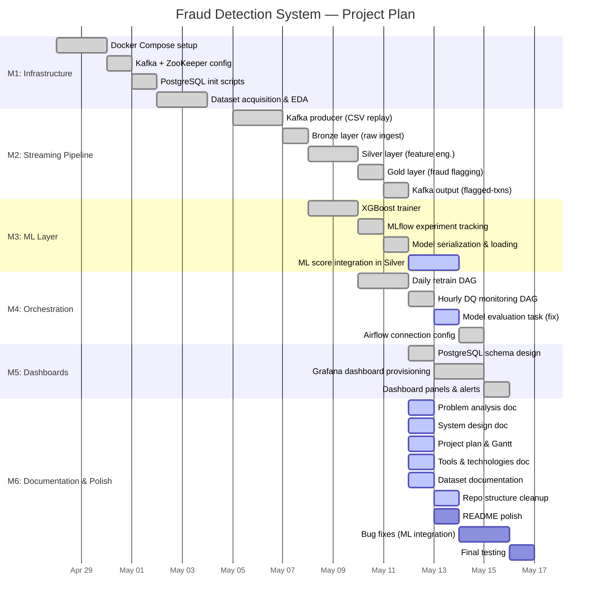

# Project Plan: Real-Time Financial Fraud Detection System

## Overview

**Project Duration**: 6 weeks (educational / portfolio project)
**Team**: Solo developer / student
**Goal**: Build a complete, end-to-end, containerized real-time fraud detection pipeline — from raw transaction ingestion through ML model training, streaming scoring, orchestration, and live dashboards.

---

## Milestones

| # | Milestone | Target Week | Status |
|---|---|---|---|
| M1 | Infrastructure & Data Foundation | Week 1 | ✅ Complete |
| M2 | Streaming Pipeline (Bronze/Silver/Gold) | Week 2 | ✅ Complete |
| M3 | ML Training & Tracking | Week 3 | ✅ Complete |
| M4 | Orchestration & Data Quality | Week 4 | ✅ Complete |
| M5 | Dashboards & Monitoring | Week 5 | ✅ Complete |
| M6 | Documentation, Testing & Polish | Week 6 | 🔄 In Progress |

---

## Gantt Chart

---

## Detailed Task Breakdown

### Week 1 — Infrastructure & Data Foundation

| Task | Description | Output |
|---|---|---|
| Docker Compose scaffold | 13-service compose file: Kafka, ZooKeeper, Spark master+worker, Airflow, MLflow, PostgreSQL, Grafana, Kafka UI | `docker-compose.yml` |
| Environment config | `.env.example` with all tunables (TPS, fraud rate, passwords, webhook) | `.env.example` |
| PostgreSQL init | Create `airflow`, `mlflow`, `fraud` databases; `fraud_metrics` and `dq_checks` tables | `scripts/init_postgres.sql` |
| Dataset acquisition | Download synthetic fraud dataset (21 features, labelled); exploratory analysis | `data/synthetic_fraud_dataset.csv` |
| Makefile | Operational shortcuts: `up`, `down`, `train`, `logs`, `status` | `Makefile` |

**Milestone M1 deliverable**: All 13 services start cleanly with `make up`.

---

### Week 2 — Streaming Pipeline

| Task | Description | Output |
|---|---|---|
| Kafka producer | CSV-replay producer with configurable TPS and fraud injection (5 patterns) | `producer/transaction_generator.py` |
| Bronze layer | Schema-enforced raw event sink to Delta Lake (append-only) | Delta `/data/delta/bronze` |
| Silver feature engineering | 10 derived features, 5 fraud flags, `rule_score` computation | Delta `/data/delta/silver` |
| ML score placeholder | Load `fraud_model.pkl` if present; return 0.0 placeholder otherwise | `spark_jobs/fraud_streaming_job.py` |
| Gold layer | Filter `is_flagged=1`; write Delta + Kafka + PostgreSQL | Delta `/data/delta/gold` |
| End-to-end smoke test | `make kafka-consume-fraud` shows flagged transactions | — |

**Milestone M2 deliverable**: Transactions flow from CSV → Kafka → Spark → Delta → flagged alerts.

---

### Week 3 — ML Layer

| Task | Description | Output |
|---|---|---|
| XGBoost trainer | Train on Silver Delta or CSV; `scale_pos_weight` for imbalance; 80/20 split | `ml/train_model.py` |
| MLflow tracking | Log ROC-AUC, PR-AUC, Precision, Recall, F1, feature importances | MLflow experiment UI |
| Model artifact | Save `fraud_model.pkl` to shared Docker volume | `models-data` volume |
| Spark integration | Load model in streaming job; wire `ml_score` into Silver layer | `spark_jobs/fraud_streaming_job.py` |
| `make train-kaggle` | One-command training using the mounted CSV | `Makefile` |

**Milestone M3 deliverable**: `make train-kaggle` produces a model with ROC-AUC ≥ 0.85, tracked in MLflow.

---

### Week 4 — Orchestration

| Task | Description | Output |
|---|---|---|
| Daily retrain DAG | `validate_silver → decide_retrain → retrain → evaluate → promote → notify` | `dags/fraud_detection_daily_dag.py` |
| Hourly DQ DAG | 4 parallel checks: row counts, schema, null rates, fraud rate | `dags/data_quality_monitoring_dag.py` |
| DQ results to PostgreSQL | Write check results to `dq_checks` table | PostgreSQL |
| Airflow connections | Configure Spark submit + PostgreSQL connections | Airflow UI |
| Model evaluation fix | Replace random noise test data with real Silver samples | `dags/fraud_detection_daily_dag.py` |

**Milestone M4 deliverable**: Both DAGs run without errors; DQ results appear in PostgreSQL.

---

### Week 5 — Dashboards & Monitoring

| Task | Description | Output |
|---|---|---|
| Grafana data source | PostgreSQL data source auto-provisioned | `grafana/provisioning/datasources/` |
| Dashboard JSON | 7 panels: counts, amounts, DQ pass rate, time-series, log table, bar chart | `grafana/dashboards/fraud_overview.json` |
| Dashboard provisioning | Auto-load on container start | `grafana/provisioning/dashboards/` |
| Verify live data | Confirm panels refresh with real streaming data | — |

**Milestone M5 deliverable**: Grafana dashboard shows live fraud metrics without manual setup.

---

### Week 6 — Documentation, Testing & Polish

| Task | Description | Output |
|---|---|---|
| Problem analysis | Business context, fraud patterns, success metrics | `documentation/01_problem_analysis.md` |
| System design | Architecture diagrams, DAG flows, component design | `documentation/02_system_design.md` |
| Project plan | This document + Gantt chart | `documentation/03_project_plan.md` |
| Tools & technologies | Stack rationale, version matrix, dependency map | `documentation/04_tools_and_technologies.md` |
| Dataset documentation | Schema, statistics, feature descriptions, bias notes | `documentation/05_datasets.md` |
| Repo structure | Add `documentation/`, `logs/`, `.gitkeep` files | repo root |
| Bug fixes | Fix ML integration gap; fix evaluate_model noise data; fix row count sentinel | source files |
| README polish | Ensure quick-start still accurate after restructure | `README.md` |
| Final smoke test | `make up && make train-kaggle` — verify full pipeline end-to-end | — |

**Milestone M6 deliverable**: Complete, documented, working system ready for portfolio submission.

---

## Risk Register

| Risk | Likelihood | Impact | Mitigation |
|---|---|---|---|
| Docker resource limits (8 GB RAM) | Medium | High | Reduce Spark worker memory; shut down unused services |
| Kafka consumer lag | Low | Medium | Increase micro-batch trigger interval; reduce TPS |
| Delta Lake write conflicts | Low | Medium | Unified `foreachBatch` avoids concurrent writes |
| MLflow experiment tracking DB corruption | Low | Low | PostgreSQL backend is more reliable than SQLite |
| Dataset class imbalance causing poor model | Medium | High | `scale_pos_weight`, PR-AUC primary metric |
| Concept drift in production | High (long-term) | High | Daily retraining DAG built from day one |

---

## Definition of Done

A milestone is **done** when:
1. All tasks in its section produce the stated outputs.
2. `make up` starts all relevant services without errors.
3. Logs show expected data flowing through the relevant layer.
4. Any new documentation is committed to the repo.
